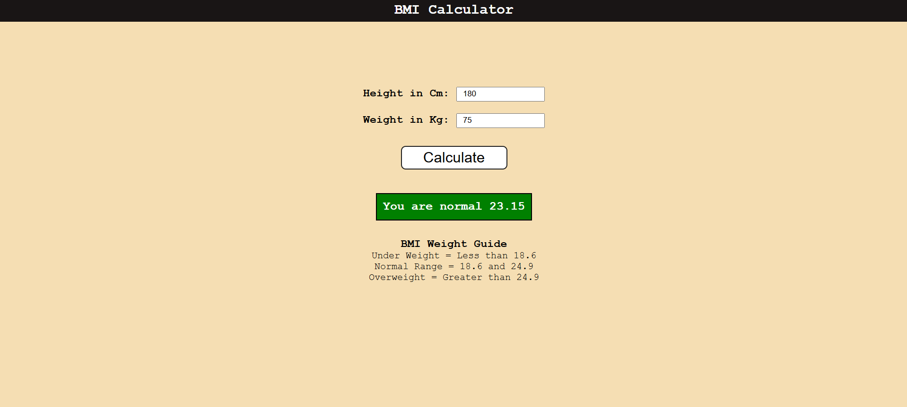

# JavaScript Projects  
_Fork it and try it!_

## 1. Color Changer - [Code File](https://github.com/Anujit1/JavaScript_Projects/tree/main/colorChanger)

---

## 2. BMI Calculator - [Code File](https://github.com/Anujit1/JavaScript_Projects/tree/main/BMI_Calculator)

---

## 3. Ticker - [Code File](https://github.com/Anujit1/JavaScript_Projects/tree/main/Clock)

---

## 4. Number Guess - [Code File](https://github.com/Anujit1/JavaScript_Projects/tree/main/guess_number)

---

## 5. Infinity Color - [Code File](https://github.com/Anujit1/JavaScript_Projects/tree/main/Display_Test)

---

## 6. Keyboard Check - [Code File](https://github.com/Anujit1/JavaScript_Projects/tree/main/keyboard_check)

---

## 7. Github Profile Card - [Code File](https://github.com/Anujit1/JavaScript_Projects/tree/main/github_profile_card)
